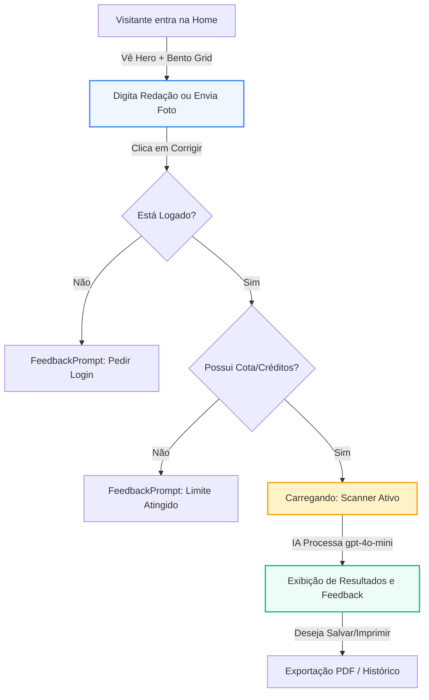
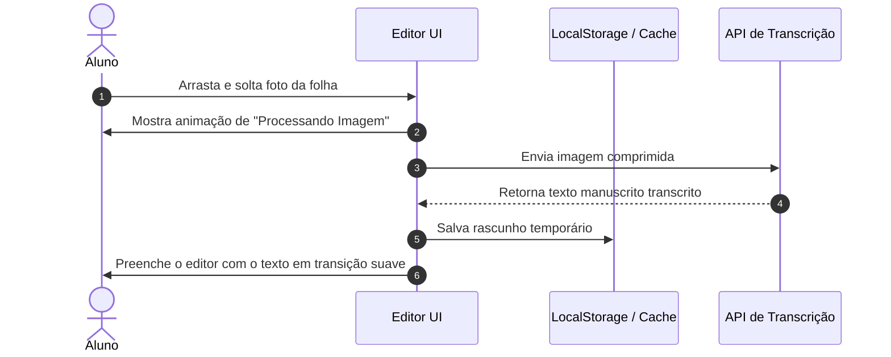

# Auditoria de UI/UX e Revisão de Código - Redator Online

Este documento apresenta uma revisão profunda do projeto **Redator Online**, focando na excelência visual, na fluidez da experiência do usuário (UX) e na robustez da arquitetura técnica. O objetivo é transformar o aplicativo em um produto SaaS altamente premium, cativante e escalável.

---

## 1. Visão Geral da Experiência Atual

O **Redator Online** possui uma fundação sólida e moderna. A escolha de simular uma folha de redação oficial do ENEM (com linhas horizontais e margem vermelha) é **excelente** e cria uma conexão imediata com o usuário. No entanto, há diversas oportunidades para elevar o design de "funcional" para "espetacular".

Abaixo está um diagrama conceitual do fluxo do usuário atual e onde as otimizações visuais e lógicas serão inseridas:



---

## 2. Auditoria e Propostas de Melhoria de UI/UX 🎨

### A. Landing Page (Hero, Bento Grid e Tipografia)
A primeira impressão precisa encantar instantaneamente o estudante. Atualmente, a página é bonita, mas ligeiramente estática.

*   **A Paleta "Academic Calm":**
    *   *Status Atual:* O azul marinho (`#1e3a8a`) e o azul claro (`#3b82f6`) dão um tom sério e educacional.
    *   *Upgrade Premium:* Manter a seriedade acadêmica, mas adicionar toques modernos como **efeitos de vidro (glassmorphism)** nos cards, fundos com gradientes suaves em HSL e **micro-interações no hover** dos botões.
*   **Hero Section:**
    *   *Status Atual:* O lado direito exibe um vetor SVG estático simples de um papel.
    *   *Upgrade Premium:* Transformar esse SVG em uma representação semi-interativa ou criar uma ilustração abstrata de alta fidelidade mostrando um papel se transformando em dados brilhantes (ícones flutuantes de IA, notas de competências e faíscas).
*   **Bento Grid:**
    *   *Status Atual:* Três cards estáticos simples que reagem ao hover com um deslocamento para cima (`translateY`).
    *   *Upgrade Premium:* Adicionar bordas brilhantes sutis que seguem o movimento do cursor ou usar gradientes de fundo muito suaves que mudam no foco.

| Componente | Design Atual | Proposta Premium (Wow Factor) |
| :--- | :--- | :--- |
| **Hero Image** | SVG plano de um documento e um checkmark. | Mockup 3D translúcido de uma folha de redação flutuando com partículas de IA brilhando ao redor. |
| **Bento Grid** | Cards brancos com bordas sólidas cinzas. | Efeito de Glassmorphism leve, cantos arredondados generosos, sombra suave com desfoque amplo e micro-animações nas ilustrações. |
| **Navbar** | Fundo branco semitransparente básico. | Efeito de desfoque de fundo (`backdrop-filter: blur(16px)`), indicador dinâmico de progresso de uso na barra. |

### B. O Editor de Redação (Área Crítica de Interação)
Este é o coração do sistema. O aluno passa a maior parte do tempo aqui.

*   **Tipografia da Escrita (Fonte Kalam):**
    *   *O Problema:* A fonte cursiva `Kalam` é visualmente fiel ao manuscrito. Contudo, em redações longas (até 30 linhas), ela pode se tornar cansativa de ler e reduzir a acessibilidade.
    *   *O Upgrade:* Implementar um seletor visual na barra de status do editor para que o usuário possa escolher entre **"Manuscrito" (Kalam)** e **"Legível/Digitação" (Inter ou Outfit)**. Isso empodera o aluno e melhora drasticamente a usabilidade.
*   **Feedback de Autosave:**
    *   *O Problema:* O texto "Autosave on" fica estático no canto inferior direito.
    *   *O Upgrade:* Adicionar um pequeno indicador em LED pulsante. Quando o usuário digita, o LED pisca em amarelo ("Salvando..."); quando para, fica verde estável ("Salvo no navegador").
*   **Upload e Transcrição por Foto:**
    *   *O Problema:* O botão "Enviar foto da folha" é apenas um botão cinza comum.
    *   *O Upgrade:* Implementar uma **Área de Drag-and-Drop (Arrastar e Soltar)** interativa sobre o próprio editor. Quando o aluno arrasta uma foto da redação manuscrita, a tela inteira do editor escurece suavemente com uma borda tracejada brilhante convidando-o a soltar a imagem ali.



### C. A Tela de Resultados (A Entrega de Valor)
O momento em que o aluno vê a sua nota é onde ele precisa se sentir em uma plataforma extremamente profissional.

*   **Visualização da Nota Final:**
    *   *Status Atual:* Uma esfera azul sólida com o texto da nota centralizado.
    *   *Upgrade Premium:* Criar um **anel de progresso radial animado em SVG** que preenche de 0 a 1000 quando a página carrega. Se a nota for maior que 900, adicionar um efeito sutil de confete digital dourado ou faíscas ao redor da pontuação.
*   **Gráfico de Desempenho por Competência:**
    *   *Status Atual:* Barras de progresso horizontais básicas.
    *   *Upgrade Premium:* Em vez de barras simples, criar cartões individuais para cada competência com gráficos de radar interativos ou medidores circulares. Cada cartão pode ter um acordeão com transições fluidas para expandir as dicas detalhadas de melhoria.
*   **Correção Inteligente Direta no Texto (O Maior "Wow Factor"):**
    *   *O Problema:* Hoje, a IA dá dicas gerais. O aluno não sabe exatamente em qual linha cometeu o desvio de gramática ou onde a coesão falhou.
    *   *A Solução:* No futuro, utilizar a inteligência da IA para mapear desvios e exibi-los marcados diretamente no texto com cores específicas (Ex: Vermelho para gramática, Verde para bom uso de repertório). Ao passar o mouse sobre o trecho destacado, um popover elegante mostra a explicação e a correção sugerida.

---

## 3. Revisão da Arquitetura Técnica e Código-Fonte 🛠️

Durante a varredura do codebase, identifiquei gargalos estruturais e técnicos que podem afetar o desempenho, a segurança e o build em produção do Next.js.

### A. Centralização e Regras de Negócio (Quota e Planos)
*   **O Problema (Lógica Hardcoded e Duplicada):**
    *   Tanto no `/api/evaluate/route.ts` quanto no `/api/transcribe/route.ts`, a lógica de verificar se a assinatura expirou, calcular a cota e somar o total de redações enviadas é duplicada.
    *   O ID do plano Pro 100 está de forma estática em múltiplos arquivos (ex: `dbUser.planId === 'pro_100'`). Se um novo plano for lançado, o desenvolvedor precisará alterar o código em vários lugares.
*   **A Solução:** Criar um **`QuotaService`** centralizado em `src/lib/quota.ts` que gerencie o ciclo de vida do limite do usuário e as capacidades ativas de cada plano de forma dinâmica (lendo do banco de dados).

```typescript
// Exemplo conceitual do QuotaService a ser implementado
export class QuotaService {
  static async checkUserQuota(userId: string, actionType: 'essay' | 'transcription') {
    const dbUser = await userRepository.getById(userId);
    if (!dbUser) throw new Error('Usuário não encontrado');
    
    const plan = dbUser.plan || { essayLimit: 3, name: 'Grátis' };
    const used = actionType === 'essay' ? dbUser.essaysUsed : dbUser.transcriptionsUsed;
    
    // Validação de expiração de assinatura
    if (dbUser.planId !== 'free' && dbUser.subscriptionExpiresAt) {
      if (new Date() > new Date(dbUser.subscriptionExpiresAt) && dbUser.subscriptionStatus !== 'active') {
        return { allowed: false, reason: 'subscription_expired' };
      }
    }
    
    if ((used || 0) >= plan.essayLimit) {
      return { allowed: false, reason: 'limit_reached', limit: plan.essayLimit };
    }
    
    return { allowed: true, currentCount: used };
  }
}
```

### B. Otimização e Erros de Build do Next.js 16
No Next.js 16, as regras de compilação são muito estritas. Os seguintes pontos impedem o deploy bem-sucedido em produção (`npm run build`):

1.  **Tipagem Estrita (Eliminação do `any`):**
    *   Existem cerca de 17 ocorrências do tipo genérico `any` nas rotas e repositórios. Isso anula a segurança do TypeScript e esconde falhas de tempo de execução (runtime errors).
    *   *Solução:* Tipar os payloads de webhook usando Zod ou mapear interfaces exatas provenientes do Stripe SDK.
2.  **Violador de Hooks do React (Renderizações em Cascata):**
    *   No arquivo `src/app/page.tsx`, há chamadas síncronas de alteração de estado no corpo do componente que geram renders em cascata desnecessários.
    *   No arquivo `src/components/Pricing.tsx`, a modificação direta de `window.location.href` sem abstração ou tratamento de estado pendente pode quebrar a hidratação do Next.js.
3.  **Componentes de Imagem Sem Otimização:**
    *   Alguns arquivos (como o `Navbar.tsx`) utilizam a tag HTML clássica `` em vez do componente `<Image />` do Next.js. Isso desativa a compressão automática e o carregamento responsivo.
4.  **Consistência de Documentação:**
    *   O arquivo de configuração do projeto (`GEMINI.md`) menciona **Mercado Pago** como meio de pagamento principal, enquanto o código está estruturado usando exclusivamente o **Stripe**.
    *   *Solução:* Atualizar todas as referências de documentação técnica para o Stripe para evitar confusão de novos desenvolvedores.

---

## 4. Plano de Ação Estruturado 🚀

Para organizar a execução destas melhorias sem interromper a estabilidade atual da plataforma, dividimos o plano em três fases.

### Fase 1: Correções Críticas e Build Saudável (Curto Prazo - Técnico)
Focado em garantir estabilidade, segurança e preparar o sistema para deploy contínuo em produção.

- [ ] **Sanitização de TypeScript:** Substituir todos os tipos `any` nas pastas `src/app/api` e `src/db/repositories` por tipos explícitos gerados pelo Drizzle ORM ou Zod.
- [ ] **Otimização de Imagens:** Migrar todas as ocorrências de `` na interface para o `<Image />` do Next.js com as configurações adequadas de largura/altura.
- [ ] **Unificação de Limites:** Criar e implementar o `QuotaService` para centralizar as validações de limite de uso de correção e transcrição por imagem.
- [ ] **Alinhamento de Docs:** Revisar `GEMINI.md` e o código de Webhooks para garantir que todas as referências apontem exclusivamente para o fluxo do Stripe.

### Fase 2: Experiência do Usuário (Médio Prazo - UX e Design)
Focado em refinar a jornada do aluno, tornando o uso muito mais cativante e interativo.

- [ ] **LED de Autosave no Editor:** Desenvolver o componente indicador de salvamento interativo (verde/amarelo piscante) no rodapé do editor.
- [ ] **Seletor de Fontes:** Adicionar o seletor visual na barra de status do editor permitindo que o aluno alterne entre a fonte manuscrita (`Kalam`) e a fonte limpa (`Inter` / `Outfit`).
- [ ] **Anel Radial de Pontuação:** Substituir a esfera de pontuação estática dos resultados por um SVG radial com preenchimento animado cronometrado.
- [ ] **Área Drag-and-Drop de Imagens:** Adicionar suporte visual elegante para arrastar e soltar redações manuscritas diretamente no editor.

### Fase 3: Funcionalidades Avançadas e Escala (Longo Prazo - SaaS Premium)
Focado na retenção de usuários, aumento da taxa de conversão (CRO) e experiência premium digna de um SaaS líder.

- [ ] **Persistência de Rascunhos no BD:** Para usuários logados, salvar os rascunhos em tempo real no banco de dados (`/api/essays/draft`) para continuidade entre dispositivos.
- [ ] **Recuperação de Texto pós-Login:** Integrar um middleware ou estado local que guarde o texto digitado pelo visitante quando ele atinge o limite grátis e clica em "Criar Conta", preenchendo automaticamente o editor assim que ele retorna do fluxo do Google Social Auth.
- [ ] **Gráfico de Evolução de Notas:** Na página `/history`, renderizar um gráfico de linha interativo exibindo a evolução da média geral do aluno com base nas suas últimas 10 redações.
- [ ] **Marcações Visuais de Erros Inline:** Processar o JSON da IA para identificar fragmentos exatos de texto errados e sublinhá-los visualmente na tela de resultados, oferecendo correções inteligentes no estilo Grammarly.

---

> [!NOTE]
> Este plano visa aumentar a satisfação do aluno ao usar o editor, melhorar a fidelidade técnica do código e preparar a plataforma para campanhas de marketing em larga escala com um produto visualmente impecável.
